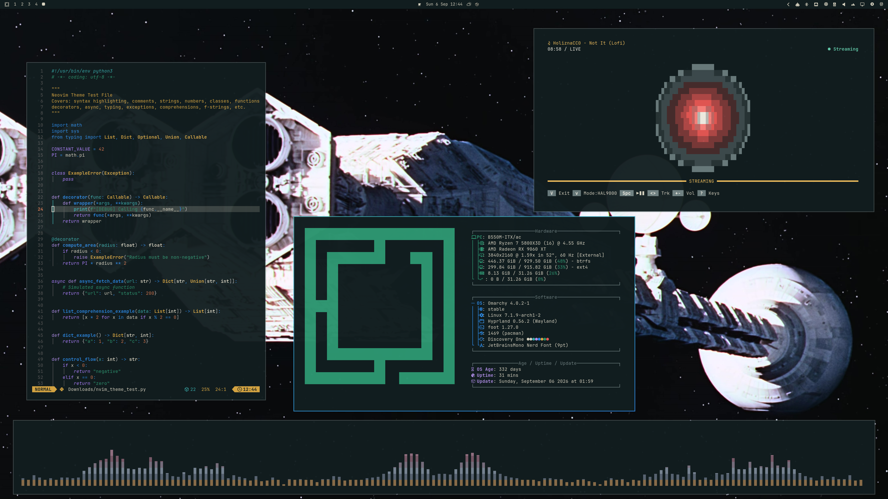
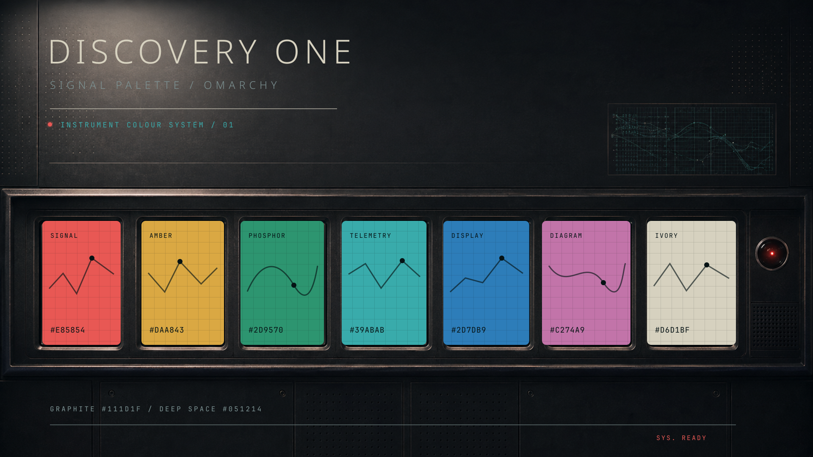
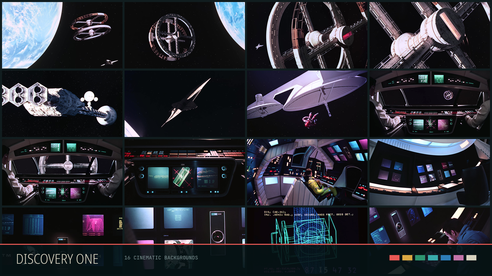

# Discovery One

A dark, architectural Omarchy theme inspired by the clean geometry, practical
futurism, and quiet unease of *2001: A Space Odyssey*.



## Character

Graphite spacecraft panels, warm ivory text, cool instrument shadows, and one
HAL-like signal-red indicator. The terminal palette adds restrained amber,
phosphor teal, blue, and diagram magenta without turning the desktop into a
neon or gamer theme.

**Should feel:** precise, spacious, calm, clinical, curious, expensive, and a
little uncanny.

**Should not feel:** cyberpunk, gamer-RGB, glossy, militaristic, or like a
generic black-and-red hacker theme.

## Install

```bash
omarchy theme install https://github.com/Devis99/omarchy-discovery-one-theme.git
omarchy theme set discovery-one
```

To remove it, delete `~/.config/omarchy/themes/discovery-one` and select another
theme.

## Palette



| Role | Colour |
|---|---|
| Background | `#111d1f` graphite teal-black |
| Foreground | `#d6d1bf` warm ivory |
| Signal red | `#e85854` |
| Telemetry amber | `#daa843` |
| Phosphor green | `#2d9570` |
| Instrument teal | `#39abab` |
| Display blue | `#2d7db9` |
| Diagram magenta | `#c274a9` |

## Included



- `colors.toml` — Omarchy colour definitions and ANSI terminal palette
- `icons.theme` — Yaru icon theme
- `backgrounds/` — 16 curated 3840×1760 *2001* spacecraft, station, and
  computer-interface frames
- `DESIGN.md` — visual direction and role rules
- `backgrounds/SOURCES.md` — wallpaper frame references

Discovery One is intentionally quiet: red is reserved for focus and warning,
while the wallpapers and window layout provide most of the depth.

## Image credits

The wallpaper frames are from *2001: A Space Odyssey* (1968), sourced from
[Movie-Screencaps](https://www.movie-screencaps.com/2001-a-space-odyssey-1968-4k/)
and hosted by [Screencaps](https://imgs.screencaps.us/196/4k-8-spaceodyssee/full/).
Individual frame references are listed in
[`backgrounds/SOURCES.md`](backgrounds/SOURCES.md).
