# Discovery One Omarchy Theme

An Omarchy theme based on *2001: A Space Odyssey*: graphite spacecraft panels, warm ivory text and the ship's instrument screens. Display blue frames every focused window and menu, and HAL's red is held back for alerts.

## Preview

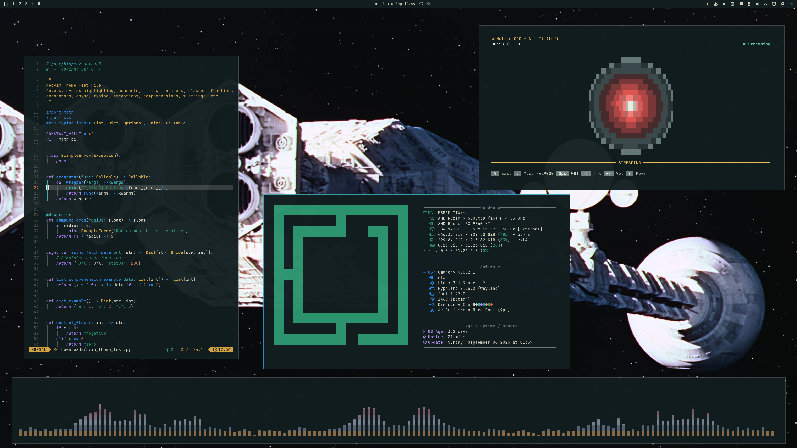

<table>
  <tr>
    <td>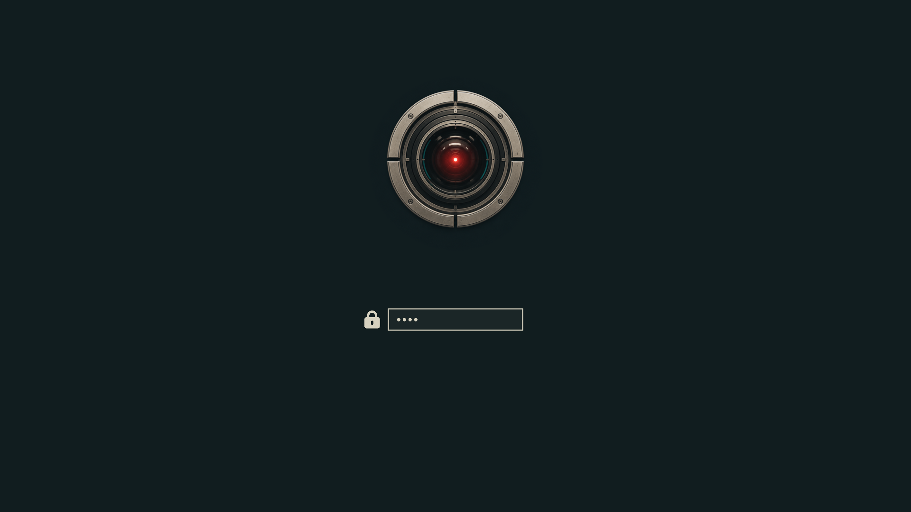</td>
  </tr>
</table>

## Install

```bash
omarchy theme install https://github.com/Devis99/omarchy-discovery-one-theme
```

## What's Included

- Core Omarchy colours, a display-screen window border (blue into AE-35 cyan) and a matching menu and launcher.
- App themes for Discord (Vencord), GTK, Zen, Zed, btop, cava and cliamp, plus Yaru icons.
- A Plymouth unlock logo and a 12-wallpaper set in `backgrounds/`.
- Pairs with the [HAL 9000 cliamp visualizer](https://github.com/Devis99/cliamp-plugin-hal9000).

## Palette

Every colour is measured from the wallpapers: red from HAL's iris and its glow, blue from the display screens, cyan from the AE-35 wireframe, green, amber and orange from the pod's consoles, and magenta from the graph screens. Each sits at the peak saturation it reaches in the film, never past it, on a teal-black ground with warm ivory text.

It is a quiet theme: display blue carries focus, red is kept for warnings alone so it keeps its authority, and the wallpapers provide most of the colour.

## Wallpapers

All wallpapers are 3840x2160. The frames are from *2001: A Space Odyssey* (1968), which belongs to Turner Entertainment Co. and Warner Bros.; they're here for personal desktop theming in an unofficial fan theme. Frame numbers are in `backgrounds/SOURCES.md`.

<table>
  <tr>
    <td>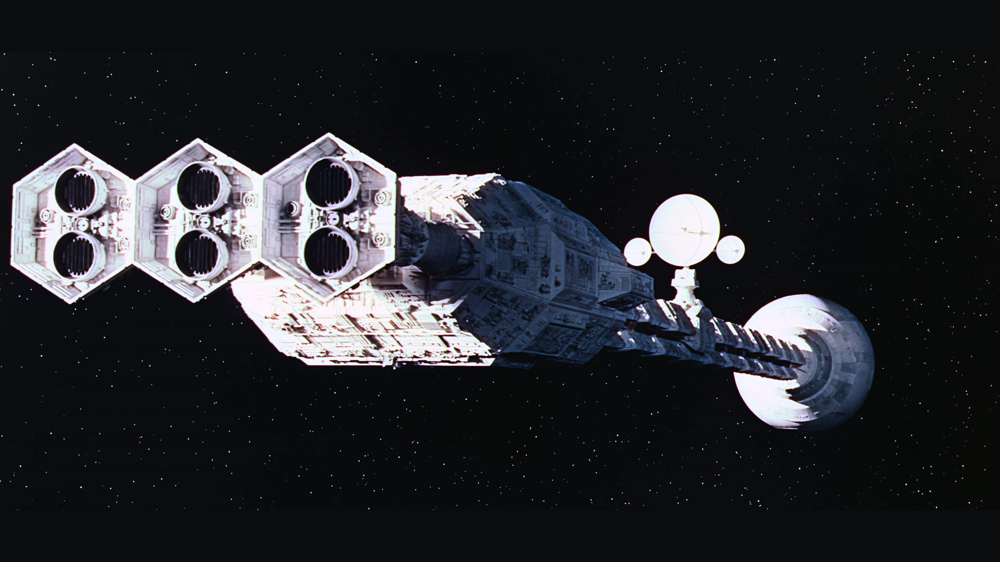<br><sub>01 Discovery One</sub></td>
    <td>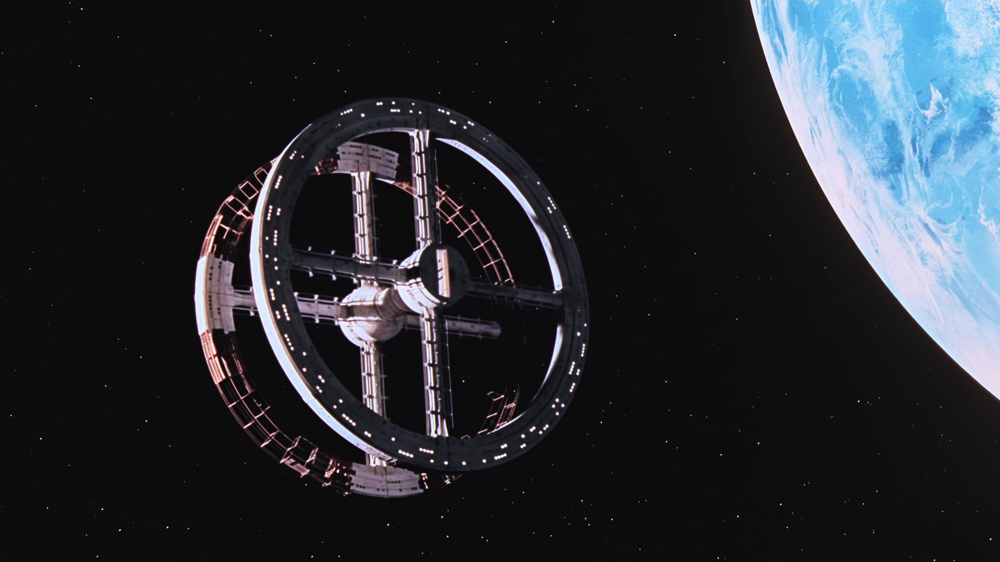<br><sub>02 Orbital Station</sub></td>
    <td>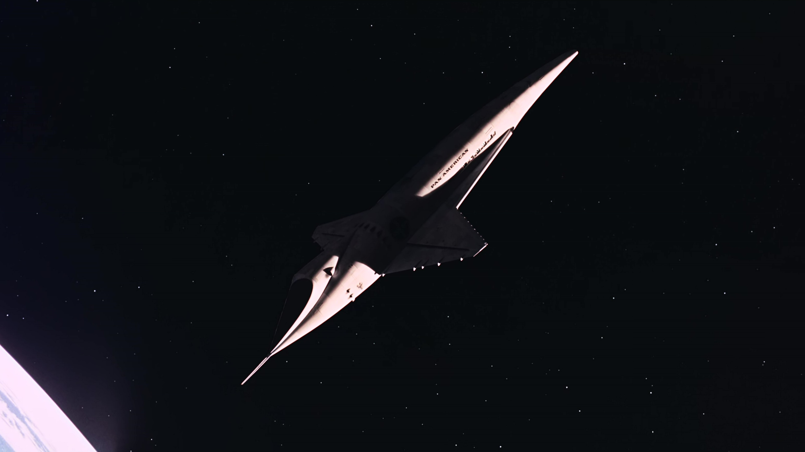<br><sub>03 Orion Shuttle</sub></td>
  </tr>
  <tr>
    <td>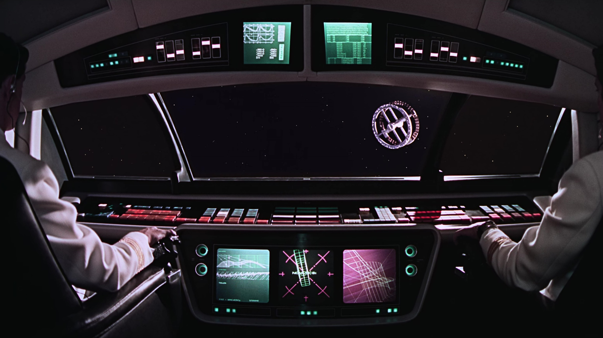<br><sub>04 Orion Flight Deck</sub></td>
    <td>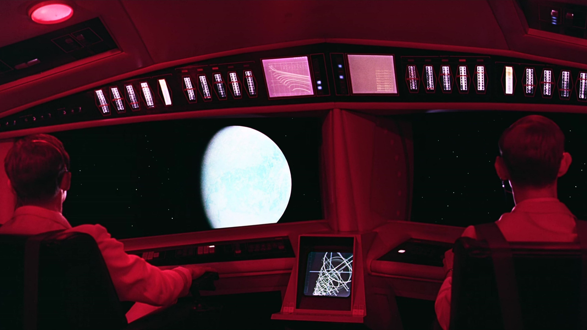<br><sub>05 Lunar Cockpit</sub></td>
    <td>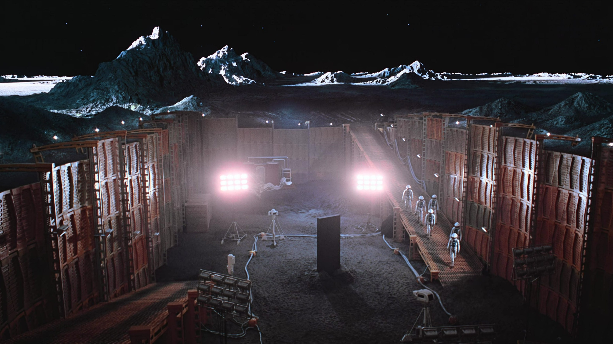<br><sub>06 Monolith Excavation</sub></td>
  </tr>
  <tr>
    <td>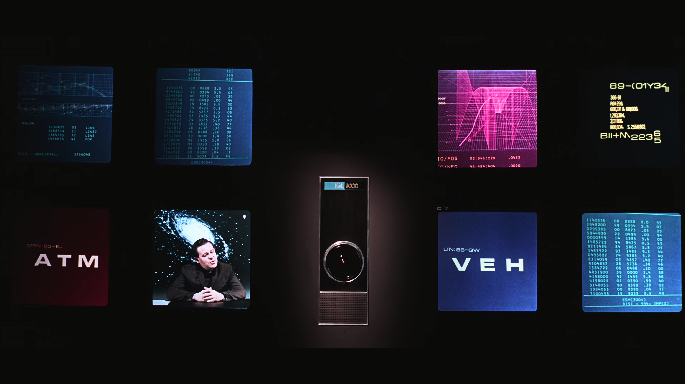<br><sub>07 HAL Interface Bank</sub></td>
    <td>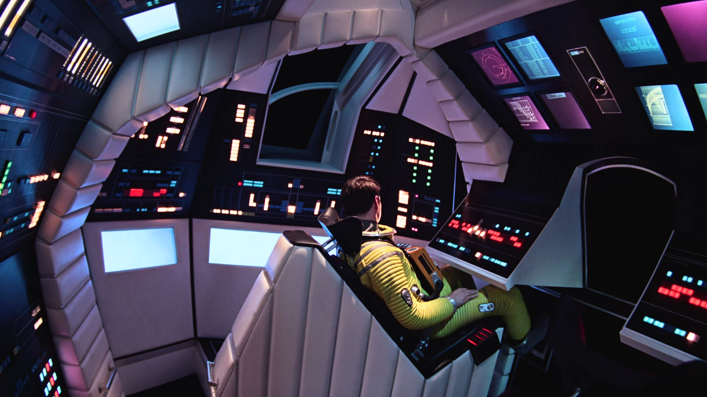<br><sub>08 Pod Cockpit</sub></td>
    <td>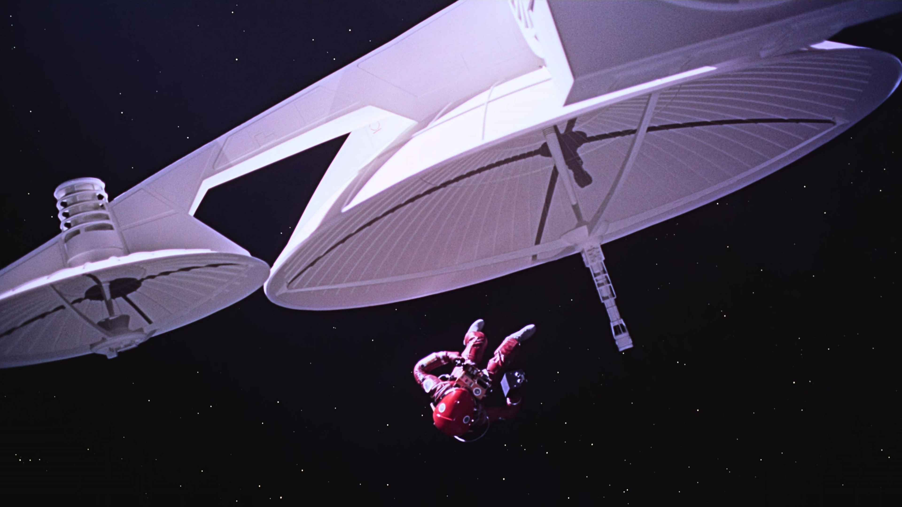<br><sub>09 Discovery Eva</sub></td>
  </tr>
  <tr>
    <td>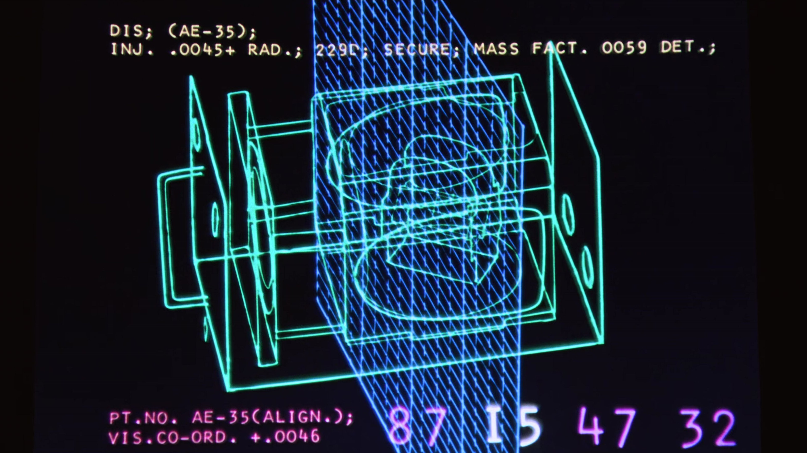<br><sub>10 AE-35 Display</sub></td>
    <td><br><sub>11 HAL Eye</sub></td>
    <td>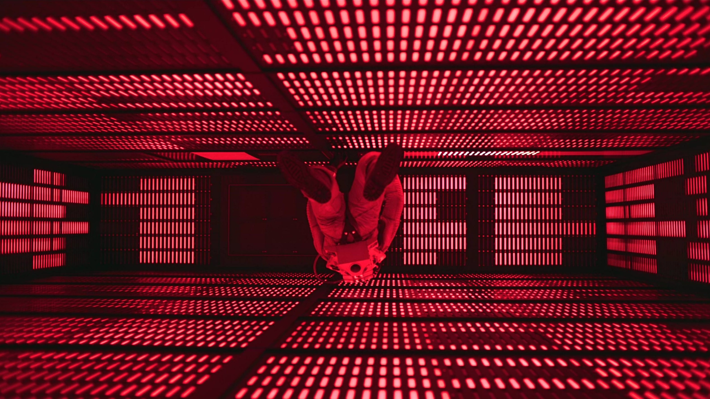<br><sub>12 HAL Memory Room</sub></td>
  </tr>
</table>
